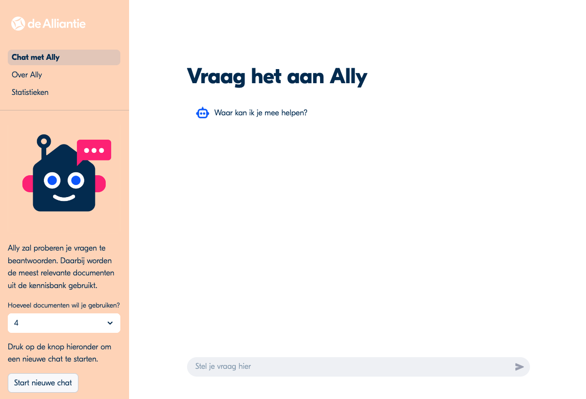
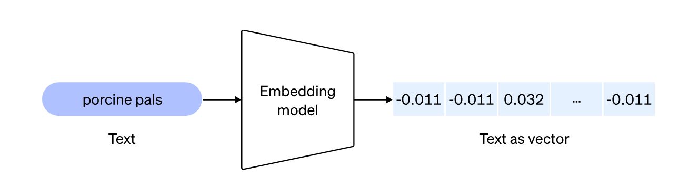

# Ally
Ally is een chatbot voor medewerkers van de klantenservice van de Alliantie. Ally helpt om snel informatie in de kennisbank van de klantenservice met behulp van natuurlijke taal op te zoeken.



## 1 Achtergrond & doel
### Achtergrond

Medewerkers van de klantenservice moeten vaak lang zoeken naar relevante informatie in hun kennisbank.

Als ze deze niet kunnen vinden raadplegen ze senior medewerkers. Deze raken hierdoor overvraagd en de huurder moet langer wachten op een antwoord op haar/zijn vraag.

### Doel

Via een chat-with-your-documents oplossing op de kennisbank kunnen medewerkers van de klantenservice sneller relevante informatie vinden in de kennisbank zodat:

- de klant sneller geholpen kan worden (kortere wachtstanden);

- de senior medewerkers minder vragen binnenkrijgen waarvoor al een antwoord in de kennisbank bestaat.

- door een feedback-lus te faciliteren kan ook inzichtelijk gemaakt worden voor welke zoekopdrachten de medewerker nog steeds problemen heeft. Dit kan dan aanleiding zijn om bijv. een artikel toe te voegen of aan te passen.


## 2. Methode

### 2.1 Semantisch zoeken & chatten

We maken gebruik van een simpele Retrieval-Augmented Generation (RAG) oplossing om ‘chat-with-your-documents’ te faciliteren. Deze oplossing werkt op hoofdlijnen als volgt.

#### Omzetten van documenten naar een vectorstore
- documenten worden gesplitst in kleine stukjes;
- de resulterende stukjes tekst worden omgezet naar (numerieke) vectoren met behulp van een embedding model;



- op die manier ontstaat een dataset van vectoren - de zogenaamde vectorstore;
- momenteel maken we gebruik van Faiss (ontwikkeld door Facebook; open source) voor de vectorstore en van het text-embedding-ada-002 embedding model (via Azure OpenAI).

#### Beantwoorden van vragen (chat-with-your-data)

Dit gaat in 2 stappen:

1. De vraag van de gebruiker wordt omgezet naar een vector. Vervolgens wordt binnen de vectorstore 'gezocht' naar vectoren (stukken tekst) die hier zo goed mogelijk op lijken (semantic search).

2. Vervolgens wordt de oorspronkelijke vraag in combinatie met de gevonden vectoren (oftewel de relevante documenten uit de kennisbank) doorgegeven aan een chat-LLM die de vraag beantwoord op basis van de gevonden documenten.

Voor de chat-LLM maken we momenteel gebruik van chatGPT-4o (via Azure Open AI).

Een groot deel van de aansturing van de chat handelen we af door gebruik te maken van de Python package [LangChain](https://python.langchain.com/docs/get_started/introduction). 

## 3. Local development
Om Ally lokaal te draaien moeten de volgende stappen genomen worden.

### 3.1 Maak een conda environment aan en activeer deze

```bash
conda create -n kschat python=3.10 -y && conda activate kschat
```

### 3.2 Installeer de dependencies

```bash
pip install -r requirements-webapp.txt
pip install -r requirements-faiss.txt
```

### 3.3 Installer pre-commit

```bash
pre-commit install
```

### 3.4 Maak een FAISS index aan
Dit gebeurt in `src/scheduled_runs/my_faiss/generate_faiss_index.py`. 

Binnen de Alliantie halen we de documenten op uit onze kennisbank via een API.

Voor je eigen documenten/kennisbank kan je simpelweg een lijst van `langchain.docstore.document.Document` objecten aanleveren, hier een voorbeeld:

```python
from langchain.docstore.document import Document
from langchain_community.vectorstores import FAISS
from langchain_openai import AzureOpenAIEmbeddings

# Here you can customize the size of the chunks
text_splitter = TokenTextSplitter(encoding_name="cl100k_base", chunk_size=700, chunk_overlap=70)

# We use the text-embedding-ada-002 embeddings model
embeddings = AzureOpenAIEmbeddings(
    azure_deployment=EMBEDDINGS_MODEL,
    openai_api_version=OPENAI_API_VERSION,
    api_key=OPENAI_API_KEY,
    azure_endpoint=OPENAI_ENDPOINT,
)

# Load your own documents here...
loaded_documents = load_documents()

documents = []

for loaded_document in loaded_documents:
    document = Document(
        page_content=loaded_document, metadata={"source": "https://example.com"}
    )
    documents.append(document)

document_chunks = text_splitter.split_documents(documents)

faiss_db = FAISS.from_documents(document_chunks, embeddings)
faiss_db.save_local("data/faiss")
```

### 3.5 Zet vereiste environment variabelen in een `.env` bestand

Alle benodigde environment variabelen staan in `needed_secrets.txt`. Draai `src/manage_secrets.py` om de secrets binnen de halen en in het `.env` bestand op te slaan.

### 3.6 Start de streamlit app

```bash
streamlit run src/webapp/Chat met Ally.py --server.port 8005
```

### 3.7 Navigeer naar de webapp
[http://localhost:8005](http://localhost:8005)


## 4. Repository structuur
```
├── README.md                           <- README for developers using this project
├── .streamlit                          <- Folder containing config-file for the streamlit app
├── scripts           
|   └── lint                            <- Helper for linting
├── src
|   └── data
|       └── faiss                       <- Folder containing the FAISS vector store
|   └── legacy                          <- Folder containing legacy scripts
|   └── scheduled_runs                  <- Folder containing scripts which run in pipelines
|       └── process_chats.py            <- Script to process each chat interaction
|       └── runlogging.py               <- Helper function for logging
|       └── my_faiss                    <- Folder containing scripts to build vector store
|           └── generate_faiss_index.py <- Script to build FAISS vectore store
|           └── get_articles.py         <- Script to retrieve articles from the Helpjuice API
|           └── prepare_html_docs.py    <- Script to process a html extract from Helpjuice
|   └── webapp                          <- Folder containing files related to the webapp
|       └── img                         <- Folder containing images for the webapp
|       └── pages                       <- Folder additional pages or the webapp
|           └── 2_Over Ally.py          <- About page
|           └── 3_Statistieken.py       <- Statistics page
|       └── Chat met Ally.py            <- Main page streamlit web app
|       └── helpers_webapp.py           <- Utils for streamlit app
|       └── styles.css                  <- Custom CSS
├── test                                <- Placeholder for tests (unit, integration)
├── .pre-commit-config.yml              <- Specs for linting
├── azure-pipeline-faiss-build.yml      <- Azure DevOps pipeline to build/update vectorstore
├── azure-pipeline-github-mirror-initial.yml <- Pipeline to initially mirror to GitHub
├── azure-pipeline-github-mirror.yml      <- Azure DevOps pipeline mirror to GitHub
├── azure-pipeline-reporting-build.yml  <- Azure DevOps pipeline to generate 'daily report'  
├── azure-pipeline-schedule-runs.yml    <- Azure DevOps pipeline for reporting and vectorstore
├── azure-pipeline-webapp.yml           <- Azure DevOps pipeline to build and deploy webapp
├── changelog.md                        <- Changelog for web app
├── Dockerfile.app                      <- Dockerfile for web app
├── Dockerfile.faiss                    <- Dockerfile for constructing/updating FAISS index
├── Dockerfile.reporting                <- Dockerfile for generating reports / insights    
├── entrypoint_webapp.sh                <- Script for entrypoint (used in Dockerfile.app)
├── requirements-faiss.txt              <- Requirements-file used by Dockerfile.faiss
├── requirements-reporting.txt          <- Requirements-file used by Dockerfile.reporting
├── requirements-webapp.txt             <- Requirements-file used by Dockerfile.app
├── security.md                         <- Security protocol
├── setup.py                            <- Packaging script
├── sshd_config                         <- To enable SSH into app on Azure App Services
```

## 5. Deployment
Voor deployment wordt er van de streamlit app een docker image gebuild (`Dockerfile.app`). Dit wordt door middel van een Azure DevOps pipeline gedaan in het `azure-pipeline-webapp.yml` script. Deze docker image wordt naar een Azure App Service gedeployed, waar hij dan intern beschikbaar is.


## 6. Overige functionaliteit

### 6.1 Metadata logging
Alle vragen en antwoorden die gesteld worden, worden gelogd op het datalake. Code hiervoor staat in `src/webapp/helpers_webapp.py` in de `save_chat()` functie.

### 6.2 Reporting
Van alle metadata zoals beschreven in **6.1**, wordt dagelijks een rapport gemaakt. Dit rapport bevat alle gestelde vragen en antwoorden van de dag. Code hiervoor staan in het `src/scheduled_runs/process_chats.py` script.

In het kort gebeurt er het volgende:
- De bestanden op het datalake worden uitgelezen
- De bestanden worden samengevoegd tot één word-bestand
- Dit word-bestand wordt op Sharepoint geplaatst
- Via een teams-webhook wordt er een bericht in een teams kanaal geplaatst met de link naar het word-bestand op Sharepoint.

### 6.3 Statistieken
Over de metadata zoals beschreven in **6.1** worden ook algemene statistieken berekend. Dit wordt in de `src/webapp/helpers_webapp.py` in de `update_usage_statistics()` functie gedaan. Op de `src/webapp/pages/3_Statistieken.py` worden deze statistieken gevisualiseerd.